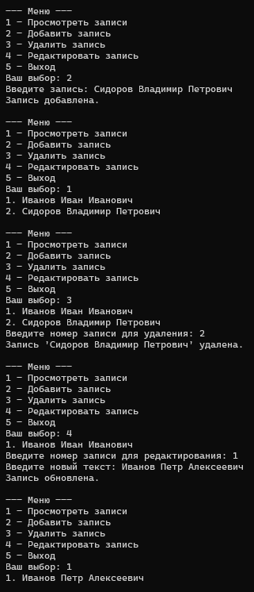

# basic database program
## Описание проекта
Basic Database Program — консольное приложение, написанное на языке программирования Python, для работы с простой текстовой базой данных.

Программа реализует базовые операции:
- Создание новой записи;
- просмотр существующих записей;
- редактирование записи;
- удаление записи.

Хранение данных осуществляется в файле `database.json`.

---

## Структура проекта
```
project/
|-- program.py # Исполняемый файл
|-- database.json # Файл базы данных
--- README.md # Документация проекта
```

---

## Используемые технологии

- Python 3.13.14

---

## Архитектура проекта

Программа состоит из нескольких основных функций:
### 1. Загрузка базы данных

Загружает данные из файла базы данных.
Назначение:
- открывает `database.json`;
- читает содержимое.

---

### 2. Сохранение базы данных

Сохраняет текущие данные в файл базы данных
Назначение:
- принимает список записей;
- записывает их в файл.

---

### 3. Вывод данных из базы

Выводит все записи в базе данных
Назначение:
- проверяет наличие записей;
- выводит их с нумерацией.

---

### 4. Добавление записи

Добавляет новую запись в базу, присваивая ей номер.
Алгоритм выполнения блока:
1) Получение ввода пользователя.
2) Проеврка наличия введенных данных.
3) Загрузка базы данных.
4) Добавление записи.
5) Сохранение изменений.

---

### 5. Удаление записи
Удаляет запись из базы по заранее выделенному номеру с учетом проверок:
- номер должен быть корректным;
- индекс должен существовать.

---

### 6. Редактирование записи
Редактирует существующую запись по заранее выделенному номеру.
Логика:
- выбирается запись по номеру;
- вводится новый текст;
- проверка валидности текста;
- сохранение изменений.

---

### 7. Вывод меню.
Отображение меню с выбором режимов после завершения каждой операции.

---

## Принцип работы
### Инициализация базы данных
При запуске программы идет проверка наличия файла базы.
`if not os.path.isfile(DB_FILE):`

В случае отсутствия файла сохдается пустая база.

---

### Формат сохранения данных
Пример содержимого:
```
[
    "test note",
    "check"
]
```

---

### Запуск программы
1. Клонирование проекта
`git clone https://github.com/Goose19/Basic-database-program.git`

2. Установка Python
Загрузите и установите Python с официального сайта, добавив Python в системные пути
`https://www.python.org/downloads/`

3. Запуск программы
`python program.py`

---

### Пример использования



---

### Обработка ошибок

Программа обрабатывает:
- пустой ввод;
- некорректный ввод номера записи;
- отсутствие записей;
- попытки удаления или редактирования записей из пустой базы.